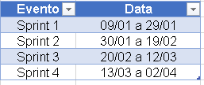
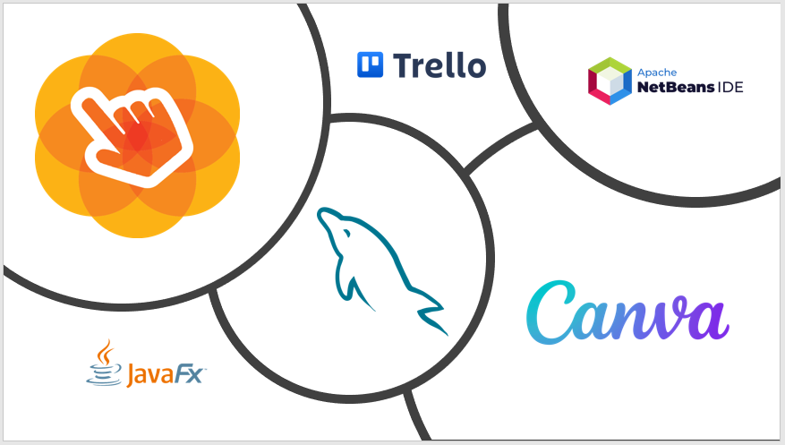
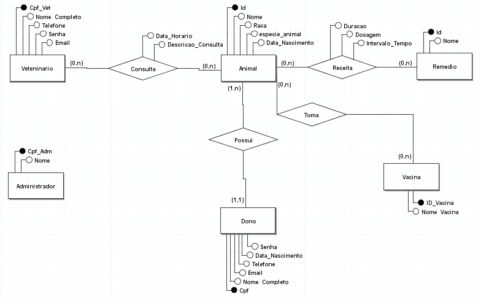

<h1 align="center"> Mania de Pet</h1>

  

## Sobre o Projeto:

* Mania de Pet é uma Clínica Veteninária fictícia com o intuito de demonstrar como o sistema funcionaria em uma Clínica na vida real;
* O objetivo deste projeto é implementar uma aplicação desktop para gerenciamento de uma Clínica Veteninária;
* A aplicação utiliza as linguagens Java, CSS e SQL, sendo respectivamente linguagens de back-end, front-end e armazenamento e gerenciamento de dados; 
* Para o gerenciamento das tarefas será necessário utilizar uma metodologia ágil, no caso o Scrum juntamente com o Kanban;
* Ao final do Projeto é esperado uma aplicação eficaz e de alta qualidade, que poderá ser vendida para empresas/terceiras.

  

## Integrante do Projeto:

| Nome | Função |
| --- | --- |
| `Lucas Emanoel Teixeira Engracio da Silva` | Product Owner, Scrum Master e DEV |

  

## :page_facing_up: Backlog do Produto:
| Requisito | Prioridade |
| --- | --- |
| `Cadastrar Administrador` | 1 |
| `Autentificar Administrador` | 1 |
| `Cadastrar Veteninário` | 1 |
| `Autentificar Veteninário` | 1 |
| `Cadastrar Responsável` | 1 |
| `Autentificar Responsável` | 1 |
| `Cadastrar Espécie de Animal` | 1 |
| `Cadastrar Animal` | 1 |
| `Cadastrar Remédios` | 2 |
| `Marcar Consulta` | 1 |
| `Adicionar Receita da Consulta` | 2 |
| `Cadastrar Vacina` | 2 |
| `Adicionar Vacina a Caderneta` | 2 |
| `Visualizar Caderneta do Animal` | 2 |
| `Visualizar Consultas` | 3 |
| `Alterar Consulta` | 3 |
| `Visualizar Veteninários` | 2 |
| `Excluir Veteninário` | 3 |

### Prioridade: 1 - Imprescíndivel; 2 - Importante; 3 - Desejável.

 

## Cronograma:

 

<h2>Tecnologias Utilizadas :electric_plug:</h2>

 

<h2>Users Storys </h2>

  ## Sprint 1:
  
  * Como __Administrador__ desejo __me cadastrar no sistema__ para __realizar minhas devidas atividades__;
  * Como __Administrador__ desejo __me autentificar no sistema__ para __conseguir ter acesso as ações da aplicação__;
  * Como __Veteninário__ desejo __me cadastrar no sistema__ para __realizar minhas devidas atividades__;
  * Como __Veteninário__ desejo __me autentificar no sistema__ para __conseguir ter acesso as ações da aplicação__;
  * Como __Responsável do Animal__ desejo __me cadastrar no sistema__ para __poder cadastrar meus animais e ver as consultas__;
  * Como __Responsável do Animal__ desejo __me autentificar no sistema__ para __conseguir ter acesso a aplicação e suas respectivas funções__.

 

## Diagrama de Entidade Relacional (DER):

 

## Modelo de Entidade Relacional (MER):

